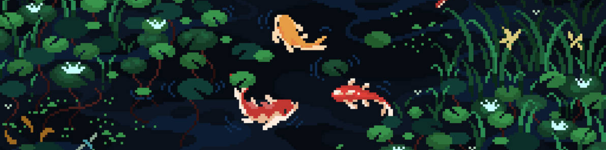

<div align="center">
  
</div>

My name is Flavio, known as M01x, I'm a computer engineer and a software development enthusiast. I enjoy learning new things📚, reading great stories🪄, and savoring good coffee☕~

> *⚠️This is my personal profile. I don't host production systems or the source code of my clients here.*
##  About Me
```typescript
const  m01x: Developer =  {
	role:  ["Computer Engineer",  "Developer",  "IT Support"],
	focus:  "Full Stack JS Development",
	passion:  "Contributing to my environment with scalable and ever-improving solutions",
	proficiency:  ["Typescript",  "PHP",  "SQL"],
	Styding:  ["Redux-toolkit",  "Node",  "Astro",  "Azure"],
	stack:  {
		frontend:  ["React",  "Shadcn"],
		backend:  ["PHP",  "Node"],
		database:  ["SQL",  "Mongo"],
		interestedIn:  ["Python",  "Power BI",  "Nest.Js",  "Astro",  "Zustand"]
	},
	buildSolutions:  ()  =>  "Scalable apps with optimal user support"
};
```
## Main Tech Stack

<table align="center">
  <tr>
    <td align="center" valign="middle">
      <h3>🖼️Frontend</h3>
      <a href="https://skillicons.dev">
        
      </a>
    </td>
    <td align="center" valign="middle">
      <h3>⚙️Backend, DB & Saas</h3>
      <a href="https://skillicons.dev">
        
      </a>
    </td>
  </tr>
  <tr>
    <td colspan="2" align="center" valign="middle">
      <h3>🧰Devtools</h3>
      <a href="https://skillicons.dev">
        
      </a>
    </td>
  </tr>
  <tr>
    <td colspan="2" align="center" valign="middle">
      <h3>👨🏾‍💻Personal environment</h3>
      <a href="https://skillicons.dev">
        
      </a>
    </td>
  </tr>
  <tr>
    <td colspan="2" align="center" valign="middle">
      <h4>🔎Interested in</h4>
      <a href="https://skillicons.dev">
        
      </a>
    </td>
  </tr>
</table>

<details>
  <summary><h3>📊See Stats</h3></summary>
<div align="center" style="display: flex; justify-content: center; gap: 20px;">
  
  
</div>
<div align="center">
  
</div>
</details>
<div align="center">

</div>
